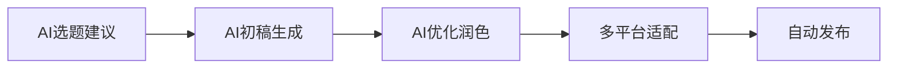

# 第1章 重新定义AI自媒体：不是"偷懒工具"，而是"赚钱引擎"

## 1.1 自媒体变现的4大核心痛点

### 📊 痛点分析

| 痛点 | 具体表现 | 影响程度 |
| :--- | :--- | :---: |
| **效率低** | 日更压力大，创作耗时过长 | ⭐⭐⭐⭐⭐ |
| **变现慢** | 粉丝增长慢， monetization周期长 | ⭐⭐⭐⭐ |
| **流量散** | 多平台运营，精力分散 | ⭐⭐⭐ |
| **合规难** | 平台规则变化，内容风险 | ⭐⭐⭐⭐ |

### 🔍 详细解析

#### 效率低的问题
- **传统创作流程**：选题1h + 写作3h + 修改1h = 5h/篇
- **日更压力**：7篇/周 × 5h = 35小时/周
- **创意枯竭**：持续输出高质量内容的心理压力

#### 变现慢的困境  
- **平台分成低**：头条号千次阅读收益0.5-3元
- **粉丝转化难**：10万粉丝月收益可能不足5000元
- **变现周期**：3-6个月才能建立稳定收入

#### 流量散的挑战
- **平台多样性**：微信、抖音、小红书、B站、知乎
- **内容适配**：每个平台需要不同的内容形式
- **时间分配**：多个账号运营时间成本高

#### 合规难的风险
- **AI内容标注**：各平台对AI生成内容的要求不同
- **版权问题**：AI生成内容的版权归属模糊
- **平台处罚**：违规内容可能导致账号限流或封禁

## 1.2 AI如何破解变现困局

### 🚀 全链路赋能方案

#### 内容生产环节


#### 效率提升数据
- **写作时间**：从5h/篇 → 1h/篇（80%提升）
- **日更能力**：从7篇/周 → 20篇/周（185%提升）
- **内容质量**：通过AI优化提升可读性和 engagement

#### 商业闭环构建
1. **流量获取**：AI多平台内容矩阵
2. **粉丝转化**：AI个性化互动和运营
3. **变现实现**：AI辅助多种 monetization 方式
4. **数据优化**：AI分析优化变现效果

### 💡 具体解决方案

#### 针对效率低
- **微撰**：3分钟生成2000字长文
- **搭画快写**：批量生产多平台内容
- **鲸达达**：一键多平台分发

#### 针对变现慢  
- **Jasper**：优化转化文案
- **宙语AI**：SEO内容提升搜索流量
- **多维变现**：广告+电商+知识付费组合

#### 针对流量散
- **内容中台**：一次生产，多平台适配
- **自动化运营**：AI管理多个账号
- **数据统一**：跨平台数据分析和优化

#### 针对合规难
- **原创度检测**：AI内容原创度优化
- **规则监控**：AI实时监测平台规则变化
- **风险预警**：提前规避合规风险

## 1.3 2025年AI自媒体的3大趋势

### 🌟 趋势一：多模态融合

#### 技术融合
- **AIGC全面升级**：从文字到图文、视频、直播
- **跨模态生成**：文生图、文生视频、文生语音
- **交互体验**：AI数字人+实时内容生成

#### 应用场景
- **短视频**：AI生成剧本+AI数字人出演
- **直播**：AI虚拟主播+实时互动
- **图文**：AI写作+AI配图+AI排版

### 🌟 趋势二：垂直深耕

#### 专业化发展
- **垂直领域**：医疗、法律、金融、教育等专业领域
- **深度内容**：AI辅助专业内容创作
- **权威建立**：AI帮助建立领域权威性

#### 商业化路径
- **知识付费**：专业课程和咨询服务
- **企业服务**：B端专业内容定制
- **会员社区**：垂直领域付费社群

### 🌟 趋势三：合规化运营

#### 规范化发展
- **平台合规**：各大平台明确AI内容规则
- **版权清晰**：AI工具版权条款规范化
- **行业标准**：AI内容创作行业标准建立

#### 风险管控
- **内容审核**：AI辅助内容审核和风险识别
- **版权保护**：AI内容版权保护和交易
- **合规培训**：AI创作者合规培训体系

## 1.4 成功案例拆解：普通人用AI实现月入5万的3个关键转折点

### 🎯 案例背景
**张三**：传统自媒体创作者，之前月收入8000元，使用AI后月入5万元

### 🔑 关键转折点一：工具重构（第1个月）

#### 改变前
- 手工写作：5h/篇，7篇/周
- 单平台运营：微信公众号
- 收入来源：流量主+偶尔广告

#### 改变后
- **工具引入**：微撰+秘塔写作猫+鲸达达
- **效率提升**：1h/篇，20篇/周
- **多平台运营**：公众号+头条号+小红书
- **收入提升**：月收入从8000元 → 15000元

### 🔑 关键转折点二：变现升级（第2-3个月）

#### 策略调整
- **内容电商**：AI种草文案带货
- **知识付费**：制作AI写作课程
- **企业服务**：接企业文案定制

#### 收入结构优化
```pie title="收入结构变化"
"流量广告" : 8000
"电商佣金" : 5000
"知识付费" : 10000
"企业服务" : 12000
```

### 🔑 关键转折点三：规模复制（第4-6个月）

#### 矩阵运营
- **账号矩阵**：5个不同领域账号
- **团队协作**：AI辅助管理小团队
- **流程标准化**：SOP化内容生产流程

#### 最终成果
- **总收入**：月入50000元
- **时间自由**：每日工作4小时
- **可持续性**：建立稳定的变现系统

### 💡 可复制经验

1. **工具先行**：先掌握核心AI工具提升效率
2. **多元变现**：不要依赖单一收入来源
3. **规模效应**：通过矩阵运营放大收益
4. **持续学习**：紧跟AI技术发展和平台规则

---

## 📝 本章小结

- **认知升级**：AI不是替代工具，而是效率倍增器
- **问题解决**：针对4大痛点有具体的AI解决方案  
- **趋势把握**：多模态、垂直化、合规化是未来方向
- **实践路径**：通过3个关键转折点实现收入跃迁

## 🎯 行动建议

1. **诊断现状**：分析自己当前处于哪个阶段
2. **选择工具**：根据需求选择合适的AI工具组合
3. **制定计划**：规划3-6个月的变现升级路径
4. **开始行动**：从效率提升开始，逐步实现多元变现