# AI自媒体写作变现知识库结构设计

## 📅 版本历史记录 (Version History)

| 修改日期 | 版本号 | 修改人 | 变更摘要 |
| :--- | :--- | :--- | :--- |
| 2025-12-11 | v1.0 | AI Assistant | 初始草稿创建 |
| 2025-12-11 | v1.1 | AI Assistant | 完善分级目录体系，增加元数据与结构图 |

## 1. 总体架构设计理念
本知识库采用飞书知识库（Lark Wiki）的多层级树状结构，旨在引导学员从零基础入门到高阶变现。
*   **核心逻辑**：漏斗式转化（免费引流 -> 基础夯实 -> 进阶深耕 -> 商业变现）。
*   **设计原则**：结构清晰、检索便捷、易于扩展。
*   **多端同步**：知识库内容支持 Web、APP、小程序等多端无缝同步访问。

---

## 2. 详细分级目录体系 (Detailed Directory Structure)

### 📂 Level 1: 00_试读区 (Free_Trial_Zone)
*   **功能描述**：对外免费开放的引流窗口，用于展示课程价值与建立信任。
*   **文档统计**：3篇
*   **权限设置**：全员可见 (Public)

#### └─ � Level 2: 课程概览 (Course_Overview)
*   **� 001_课程导读与学习路线图 (Roadmap)** [🔝置顶]
    *   *描述*：全景展示学习路径，帮助学员建立全局认知。
*   **📄 002_AI写作变现的底层逻辑 (Core_Logic)**
    *   *描述*：解析AI如何重构自媒体创作流，打破认知差。
*   **📄 003_常用的AI写作工具介绍 (Tools_Intro)**
    *   *描述*：主流AI工具（ChatGPT/Claude/Midjourney）的选型建议。

---

### 📂 Level 1: 01_基础篇：AI写作入门 (Basic_Course) 🔥[核心]
*   **功能描述**：零基础学员必修，从技术原理到工具实操，建立正确的AI认知与能力基座。
*   **文档统计**：9篇
*   **权限设置**：付费会员可见 (VIP Only)

#### └─ 📂 Level 2: 1-1_核心概念与技术原理 (Core_Concepts)
*   **📹 视频：AI写作发展历程与Transformer原理 (Video_History_Tech)**
*   **📝 指南：GPT vs BERT模型架构解析 (Guide_Model_Architecture)**
*   **🧩 模板：Prompt Engineering CIIO框架 (Template_Prompt_CIIO)**

#### └─ 📂 Level 2: 1-2_工具链与平台实操 (Tools_Practice)
*   **📹 视频：主流AI写作平台功能深度评测 (Video_Tools_Review)**
*   **📝 指南：基础写作模板使用指南 (Guide_Basic_Templates)**
*   **🧩 模板：AI内容生成质量评分表 (Template_Quality_Scorecard)**

#### └─ 📂 Level 2: 1-3_爆款标题与选题 (Viral_Titles)
*   **📹 视频：拆解10w+爆款标题 (Video_Title_Analysis)**
*   **🧩 模板：100个爆款标题公式 (Template_Title_Formulas)**

---

### 📂 Level 1: 02_进阶篇：垂直领域深耕 (Advanced_Course) 🔥[核心]
*   **功能描述**：从通用写作进阶到专业领域场景，掌握高阶调优与多模态生成技术。
*   **文档统计**：9篇
*   **权限设置**：付费会员可见 (VIP Only)

#### └─ 📂 Level 2: 2-1_行业场景化写作 (Industry_Scenarios)
*   **📹 视频：金融/科技/医疗/情感/职场等专业写作规范 (Video_Industry_Norms)**
*   **📝 指南：法律文书合规性生成指南 (Guide_Legal_Compliance)**
*   **🧩 模板：学术论文辅助写作工作流 (Template_Academic_Workflow)**

#### └─ 📂 Level 2: 2-2_高级调优技术 (Advanced_Tuning)
*   **📹 视频：构建个人/企业专属知识库(RAG) (Video_RAG_Setup)**
*   **📝 指南：风格迁移与品牌调性控制 (Guide_Style_Transfer)**
*   **🧩 模板：多模态内容生成Prompt库 (Template_Multimodal_Prompts)**

#### └─ 📂 Level 2: 2-3_短视频脚本创作 (Short_Video_Script)
*   **📹 视频：AI一键生成分镜脚本 (Video_Script_Gen)**
*   **🧩 模板：口播/剧情脚本通用框架 (Template_Script_Framework)**

---

### 📂 Level 1: 03_实战篇：变现与商业化 (Monetization_Tactics) 🔥[核心]
*   **功能描述**：打通商业闭环，从个人副业到企业服务，全方位探索变现路径。
*   **文档统计**：9篇
*   **权限设置**：付费会员可见 (按进度解锁)

#### └─ 📂 Level 2: 3-1_商业模式设计 (Business_Models)
*   **📹 视频：内容付费产品体系搭建 (Video_Content_Payment)**
*   **📝 指南：企业级SEO内容服务解决方案 (Guide_Enterprise_SEO)**
*   **📄 案例：流量变现与联盟营销实操 (Case_Traffic_Affiliate)**

#### └─ 📂 Level 2: 3-2_运营实战案例 (Operations_Cases)
*   **📹 视频：爆款内容生产SOP复盘 (Video_Viral_SOP)**
*   **📝 指南：A/B测试与转化率优化 (Guide_AB_Testing)**
*   **📄 案例：附带完整变现数据报告的案例拆解 (Case_With_Data_Report)**
*   **🧩 模板：版权管理与风控检查表 (Template_Risk_Checklist)**

#### └─ 📂 Level 2: 3-3_知识付费 (Knowledge_Payment)
*   **📝 指南：把你的经验包装成课程 (Guide_Course_Creation)**
*   **📄 案例：从0到1发售复盘 (Case_Study_Launch)**

---

### � Level 1: 04_资源中心 (Resource_Center)
*   **功能描述**：提供持续更新的辅助资源，增强用户粘性与复购率。
*   **文档统计**：持续更新
*   **权限设置**：学员专享

#### └─ 📂 Level 2: 常用资源 (Common_Assets)
*   **📄 AI工具账号共享池 (Account_Pool)** [🔝置顶]
*   **📄 每日热点选题库 (Daily_Topics)** [🔄动态更新]
*   **📄 学员优秀作业展示 (Student_Showcase)**

---

## 3. 目录结构示意图 (Directory Structure Diagram)

```mermaid
graph TD
    Root[📂 AI自媒体写作变现知识库]
    
    %% Level 1 Nodes
    L1_Free[📖 00_试读区 <br/> Free_Trial_Zone]
    L1_Basic[🔰 01_基础篇 🔥 <br/> Basic_Course]
    L1_Adv[🚀 02_进阶篇 🔥 <br/> Advanced_Course]
    L1_Money[💰 03_实战篇 🔥 <br/> Monetization_Tactics]
    L1_Res[🛠 04_资源中心 <br/> Resource_Center]
    
    %% Connections
    Root --> L1_Free
    Root --> L1_Basic
    Root --> L1_Adv
    Root --> L1_Money
    Root --> L1_Res
    
    %% Level 2 - Free
    L1_Free --> L2_Free_1[📄 课程导读 🔝]
    L1_Free --> L2_Free_2[📄 底层逻辑]
    L1_Free --> L2_Free_3[📄 工具介绍]
    
    %% Level 2 - Basic
    L1_Basic --> L2_Basic_1[📂 核心概念与原理]
    L1_Basic --> L2_Basic_2[📂 工具链与实操]
    L1_Basic --> L2_Basic_3[📂 爆款标题]
    
    %% Level 2 - Advanced
    L1_Adv --> L2_Adv_1[📂 行业场景写作]
    L1_Adv --> L2_Adv_2[📂 高级调优技术]
    L1_Adv --> L2_Adv_3[📂 短视频脚本]
    
    %% Level 2 - Monetization
    L1_Money --> L2_Money_1[📂 商业模式设计]
    L1_Money --> L2_Money_2[📂 运营实战案例]
    L1_Money --> L2_Money_3[📂 知识付费]
    
    %% Level 2 - Resources
    L1_Res --> L2_Res_1[📄 账号共享池 🔝]
    L1_Res --> L2_Res_2[📄 每日选题库 🔄]
    
    %% Styles
    classDef core fill:#f9f,stroke:#333,stroke-width:2px;
    classDef free fill:#e1f5fe,stroke:#333;
    classDef res fill:#fff3e0,stroke:#333;
    
    class L1_Basic,L1_Adv,L1_Money core;
    class L1_Free free;
    class L1_Res res;
```



```ascii
📂 AI自媒体写作变现知识库 (AI_Writer_Knowledge_Base)
├── 📖 00_试读区 (Free_Trial_Zone) [Public]
│   ├── 📄 001_课程导读与学习路线图 (Roadmap) [🔝置顶]
│   ├── 📄 002_AI写作变现的底层逻辑 (Core_Logic)
│   └── 📄 003_常用的AI写作工具介绍 (Tools_Intro)
│
├── 🔰 01_基础篇：AI写作入门 (Basic_Course) [VIP] 🔥Core
│   ├── 📂 1-1_核心概念与技术原理 (Core_Concepts)
│   │   ├── 📹 视频：AI写作发展历程与Transformer原理
│   │   ├── 📝 指南：GPT vs BERT模型架构解析
│   │   └── 🧩 模板：Prompt Engineering CIIO框架
│   ├── 📂 1-2_工具链与平台实操 (Tools_Practice)
│   │   ├── 📹 视频：主流AI写作平台功能深度评测
│   │   ├── 📝 指南：基础写作模板使用指南
│   │   └── 🧩 模板：AI内容生成质量评分表
│   └── 📂 1-3_爆款标题与选题
│       ├── 📹 视频：拆解10w+爆款标题
│       └── 🧩 模板：100个爆款标题公式
│
├── 🚀 02_进阶篇：垂直领域深耕 (Advanced_Course) [VIP] 🔥Core
│   ├── 📂 2-1_行业场景化写作 (Industry_Scenarios)
│   │   ├── 📹 视频：金融/科技/医疗专业写作规范
│   │   ├── 📝 指南：法律文书合规性生成指南
│   │   └── 🧩 模板：学术论文辅助写作工作流
│   ├── 📂 2-2_高级调优技术 (Advanced_Tuning)
│   │   ├── 📹 视频：构建个人/企业专属知识库(RAG)
│   │   ├── 📝 指南：风格迁移与品牌调性控制
│   │   └── 🧩 模板：多模态内容生成Prompt库
│   └── 📂 2-3_短视频脚本创作
│       ├── 📹 视频：AI一键生成分镜脚本
│       └── 🧩 模板：口播/剧情脚本通用框架
│
├── 💰 03_实战篇：变现与商业化 (Monetization_Tactics) [VIP] 🔥Core
│   ├── 📂 3-1_商业模式设计 (Business_Models)
│   │   ├── 📹 视频：内容付费产品体系搭建
│   │   ├── 📝 指南：企业级SEO内容服务解决方案
│   │   └── 📄 案例：流量变现与联盟营销实操
│   ├── 📂 3-2_运营实战案例 (Operations_Cases)
│   │   ├── 📹 视频：爆款内容生产SOP复盘
│   │   ├── 📝 指南：A/B测试与转化率优化
│   │   └── 🧩 模板：版权管理与风控检查表
│   └── 📂 3-3_知识付费产品打造
│       ├── 📝 指南：把你的经验包装成课程
│       └── 📄 案例：从0到1发售复盘
│
└── 🛠 04_资源中心 (Resource_Center) [VIP]
    ├── 📄 AI工具账号共享池 (Account_Pool) [🔝置顶]
    ├── 📄 每日热点选题库 (Daily_Topics) [🔄动态]
    └── 📄 学员优秀作业展示 (Student_Showcase)
```

## 2. 单页面内容标准
每个知识点页面（Page）均严格遵循以下“三位一体”结构，确保学习效果：

### A. 视频教程 (Video)
- **形式**：嵌入飞书妙记或Bilibili私密链接。
- **时长**：10-15分钟/节，干货浓缩。
- **功能**：重点讲解逻辑、演示操作步骤。

### B. 图文指南 (Text Guide)
- **形式**：富文本排版，关键步骤截图，代码块高亮。
- **内容**：视频内容的文字版复盘，补充细节与注意事项。
- **重点**：必须包含“避坑指南”模块。

### C. 案例模板 (Templates/Assets)
- **形式**：可复制的Prompt代码块、可下载的Excel/PDF附件、飞书多维表格链接。
- **作用**：拿来即用，降低学员落地难度。

## 3. 内容更新机制
- **常规更新**：每周更新“04_资源中心”的热点库。
- **版本迭代**：每月根据AI工具更新（如Midjourney V6, GPT-5等）迭代相关课程章节。
